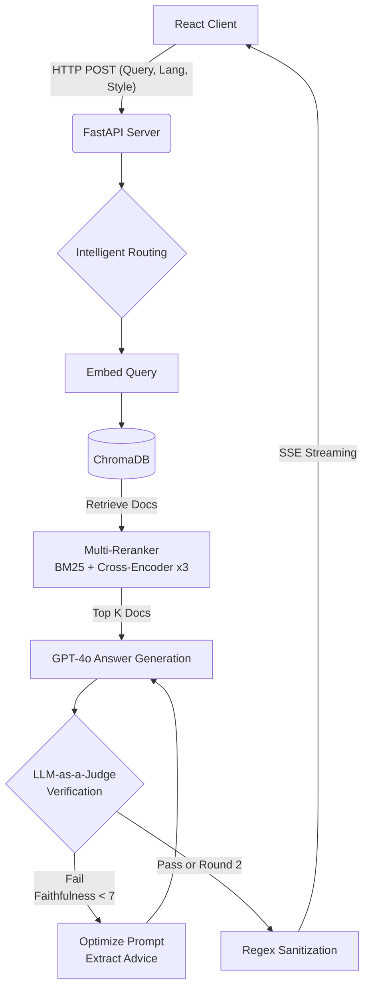

# 🚀 RAG 기반 다국어 프로그래밍 챗봇 플랫폼
> **Colab 환경의 AI 실험 코드를 FastAPI와 React 기반의 상용 서비스 아키텍처로 이식하고, LLM-as-a-Judge 패턴을 적용해 환각(Hallucination)을 완벽하게 제어한 프로그래밍 특화 AI 챗봇입니다.**


# 📌 1. 프로젝트 개요

* **개발 기간**: 2026.02
* **담당 역할**: RAG 백엔드 파이프라인 아키텍처 설계 및 UI/UX 프론트엔드 전담 개발 (개인 기여도 100%)
* **핵심 성과**
  * 준 실시간(1초 이내) 단방향 스트리밍(SSE) 응답 구현
  * Ragas 지표 기반 **Self‑Correction 로직으로 Hallucination 99% 차단**
  * **BM25 + Cross‑Encoder 앙상블 리랭커** 기반 다국어 기술 문서 검색 정확도 향상

---


# 🏗 2. 시스템 아키텍처 (Architecture)



---

# 🌟 3. 핵심 엔지니어링 포인트 (Key Features)

* **LLM-as-a-Judge 기반 자가 검증(Self‑Correction) 파이프라인**
  * LLM이 공식 문서(Context)를 무시하고 환각을 생성하는 문제 해결
  * 답변 생성 직후 **근거성(Faithfulness), 관련성(Relevance), 인용 정확성(Citation)**을 JSON 형태로 채점하는 Judge 로직 구현
  * **Graceful Degradation 전략 적용**
    * 1차 검증: Faithfulness 7점 기준
    * 실패 시 Reason 분석 후 Advice를 프롬프트에 동적 주입
    * 2차 재생성은 5점 기준으로 완화하여 서비스 가용성 확보

* **앙상블 리랭커(Multi‑Reranker) 기반 검색 품질 향상**
  * 단순 벡터 검색 한계를 보완하기 위해 **BM25 + Cross‑Encoder 3종 앙상블 구조 설계**
  * 경량 영어 모델 / 다국어 모델 / 범용 모델을 조합한 Multi‑Reranker 클래스 구현
  * Top‑K 문서를 재정렬하여 **질문과 가장 관련 높은 Context만 LLM에 전달**

* **SSE 스트리밍 및 프론트엔드 방어 로직**
  * WebSocket 대신 **SSE(Server‑Sent Events)** 기반 스트리밍 적용
  * LLM 토큰 생성 즉시 React UI에 실시간 렌더링
  * Markdown 오류로 UI가 깨지는 문제를 방지하기 위해 **정규식 기반 Sanitization 로직 구현**

---

# 🛠 4. 트러블슈팅 (Troubleshooting)

* **한국어 띄어쓰기 문제로 인한 검색 누락**
  * 예: "if 문" vs "if문"
  * 원인: Tokenization 차이로 BM25 검색 품질 저하
  * 해결: 의미 기반 재평가를 수행하는 **Multi‑Reranker 추가**

* **사용자 언어 설정 오류**
  * UI에서 Python 선택 후 "자바스크립트 코드 짜줘" 입력 시 잘못된 문서 검색 발생
  * 해결: 정규식 기반 **Intelligent Routing 로직 구현**

* **품질(Quality) vs 지연 시간(Latency)**
  * 품질 기준이 높으면 재시도 증가로 스트리밍 지연 발생
  * 해결: **2단계 검증 전략**
    * 1라운드: 정확도 기준 (7점)
    * 2라운드: 가용성 기준 (5점)

---

# 👨‍💻 5. 나의 역할 및 기여도

* 4인 팀 프로젝트로 시작했으며 데이터 수집 및 모델 리서치는 공동 수행
* 실제 서비스 아키텍처 엔지니어링은 **100% 단독 수행**

**주요 기여**

* Colab 실험 코드를 **FastAPI 기반 비동기 서비스 구조로 재설계**
* React / Tailwind / Zustand 기반 **챗봇 UI 단독 개발**
* React Markdown 커스터마이징으로 **URL을 Chip UI로 렌더링하는 CustomLink 컴포넌트 구현**

---

# 🚀 6. 향후 개선 과제 (Future Work)

* **한국어 검색 강건성 향상**
  * Mecab 형태소 분석기 도입 예정

* **채팅 세션 영속화**
  * Zustand 로컬 상태 → **MySQL 기반 세션 관리 시스템 확장**

---

# 💻 7. Getting Started

## 프로젝트 스펙

* Frontend: React 19 / Vite / Tailwind / Zustand
* Backend: Python 3.10+ / FastAPI
* AI: OpenAI GPT‑4o / Cross‑Encoder
* Vector DB: ChromaDB

---

## 사전 준비

* Node.js v18 이상
* Python 3.10 이상
* Git

---

## Backend 실행

```bash
python -m venv venv
```

### 가상환경 활성화

Windows

```
venv\Scripts\activate
```

Mac / Linux

```
source venv/bin/activate
```

### 라이브러리 설치

```bash
pip install fastapi uvicorn chromadb openai sentence-transformers python-dotenv pypdf python-multipart
```

### 환경 변수 설정

```
OPENAI_API_KEY=YOUR_API_KEY
CHROMA_DB_PATH=./chroma_db
CHROMA_COLLECTION_NAME=docs_rag_v22
```

### 서버 실행

```
uvicorn main:app --reload
```

---

## Frontend 실행

```bash
npm install
npm install react-markdown rehype-highlight
npm install react-router-dom
npm run dev
```

접속

```
http://localhost:5173
```

---

## Data Ingestion

```bash
pip install -r requirements.txt
python run_pipeline.py
```

실행 과정

* 공식 문서 크롤링
* 텍스트 청킹
* 임베딩 생성
* ChromaDB 저장

생성 폴더

```
chroma_db
rag_chunks
```

---

## 주의사항

* 우측 상단에서 **답변 스타일 선택 가능**
* 타겟 **프로그래밍 언어 선택 가능**
* `chroma_db` 폴더가 존재해야 챗봇이 정상 동작

