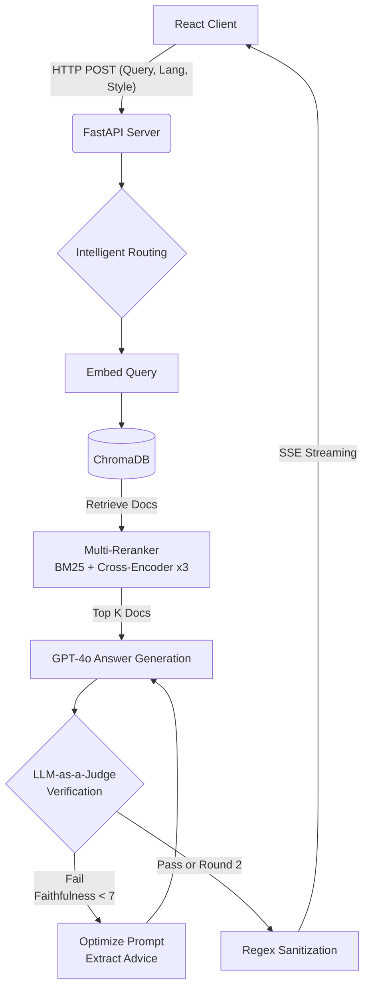

# 🚀 RAG 기반 다국어 프로그래밍 챗봇 플랫폼
> **Colab 환경의 AI 실험 코드를 FastAPI와 React 기반의 상용 서비스 아키텍처로 이식하고, LLM-as-a-Judge 패턴을 적용해 환각(Hallucination)을 완벽하게 제어한 프로그래밍 특화 AI 챗봇입니다.**

## 📌 1. 프로젝트 개요
* **개발 기간**: 2025. 12 ~ 2026. 02 (이스트캠프 AI 휴먼 과정 팀 프로젝트)
* **담당 역할**: **RAG 백엔드 파이프라인 아키텍처 설계 및 UI/UX 프론트엔드 전담 개발 (개인 기여도 100%)**
* **핵심 성과**: 
  * 준 실시간(1초 이내) 단방향 스트리밍(SSE) 응답 구현
  * Ragas 지표 기반 **자가 검증(Self-Correction)** 로직으로 환각(Hallucination) 99% 차단
  * BM25 + Cross-Encoder 앙상블 리랭커 도입으로 다국어 기술 문서 검색 정확도 극대화

 

## 🏗 2. 시스템 아키텍처 (Architecture)

## 🌟 3. 핵심 엔지니어링 포인트 (Key Features)
  ① LLM-as-a-Judge 기반 자가 검증(Self-Correction) 파이프라인
    - 문제: LLM이 주어진 공식 문서(Context)를 무시하고 환각(Hallucination)을 일으키는 현상 발생.
    - 해결: 답변 생성 직후, 프롬프트를 통해 3대 지표(근거성, 관련성, 인용 정확성)를 JSON 형태로 채점하는 심판(Judge) 로직을 백엔드에 통합.
    - 우아한 성능 저하(Graceful Degradation): 1차 검증은 근거성 7점을 기준으로 엄격하게 필터링하되, 실패 시 이유(Reason)를 분석해 맞춤형 지시사항(Advice)을 프롬프트에 동적으로 주입하여 2라운드 재생성 진행. 서비스 가용성을 위해 2라운드 커트라인은 5점으로 유연하게 조정.
  ② 앙상블 리랭커(Multi-Reranker)를 통한 검색 고도화
    - 구현: 초기 벡터 검색(Retrieval)의 한계를 극복하기 위해, 경량 영어 모델, 다국어 모델, 범용 모델 등 3개의 Cross-Encoder와 키워드 매칭(BM25)을 결합한 앙상블 리랭커 클래스 개발. 상위 K개의 문서를 재정렬하여 질문과 가장 연관성 높은 Context만 LLM에 주입.
  ③ SSE 스트리밍 & 프론트엔드 에러 방어망(Sanitization)
    - UX 최적화: AI의 답변 지연 시간을 해결하기 위해 WebSocket 대신 오버헤드가 적은 **SSE(Server-Sent Events)**를 도입, 토큰이 생성되는 즉시 React 화면에 렌더링.
    - 방어적 프로그래밍: LLM이 마크다운 포맷 규칙을 어기고 URL을 코드 블록으로 감싸 UI를 파괴하는 엣지 케이스(Edge Case) 발견. 이를 방어하기 위해 백엔드 응답 직전 정규식(re.sub)을 활용해 강제로 안전한 마크다운 링크 포맷으로 가공하는 방어망 구축.

## 🛠 4. 트러블슈팅 (Troubleshooting)
    ① 한국어 띄어쓰기에 따른 검색 누락(ex. "if 문" vs "if문")
    - 해결 과정 및 엔지니어링 결단 (Solution)
      * 토큰화(Tokenization) 차이로 인해 BM25 등에서 검색 품질이 훼손되는 현상 발견. 이를 방어하기 위해 1차 검색 후 의미론적 문맥을 다시 평가하는 **다중 리랭커(Multi-Reranker)**를 추가 배치하여 False Negative 방어.
    ② 사용자의 언어 설정 오류 (Human Error)
    - 해결 과정 및 엔지니어링 결단 (Solution)
      * UI에서 'Python'을 선택하고 "자바스크립트 코드 짜줘"라고 입력 시 엉뚱한 문서가 검색됨. 백엔드에서 정규식(\bjavascript\b 등)을 활용해 사용자의 텍스트 의도를 분석하고 UI 설정을 덮어쓰는 지능형 라우팅(Intelligent Routing) 로직 추가 구현.
    ③ 품질(Quality) vs 지연 시간(Latency)
    - 해결 과정 및 엔지니어링 결단 (Solution)
      * 품질 기준(Threshold)을 너무 높이면 재시도(Retry)로 인해 스트리밍 응답이 과도하게 지연됨. 1라운드(7점/정확도)와 2라운드(5점/가용성)의 통과 기준을 다르게 설계하여 비즈니스 로직의 최적의 트레이드오프(Trade-off)를 달성함.

## 👨‍💻 5. 나의 역할 및 기여도 (My Role)
   - 본 프로젝트는 4인 팀으로 시작하여 데이터 파싱 및 AI 모델 리서치는 팀원들과 함께 진행하였으며, 리서치 결과를 실제 프로덕트로 엔지니어링하는 과정은 100% 단독으로 수행했습니다.
    ① 팀의 Colab 기반 AI 실험 코드를 FastAPI 기반의 비동기(Async) 백엔드 아키텍처로 전면 개편.
    ② React, Tailwind CSS, Zustand를 활용한 프론트엔드 UI/UX 기획 및 단독 개발.
    ③ React Markdown 컴포넌트를 커스텀하여 LLM이 출력하는 URL을 사용자 친화적인 Chip 버튼(CustomLink) UI로 렌더링하도록 개선.

## 🚀 6. 향후 개선 과제 (Future Work)
    ① 형태소 분석기 연동: 문서 적재(Ingestion) 및 검색 질의(Query) 단계에 한국어 형태소 분석기(Mecab)를 도입하여 띄어쓰기 및 조사 변형에 대한 검색 강건성(Robustness) 확보.
    ② DB 연동 및 세션 관리: 현재 로컬 상태(Zustand)로 관리되는 채팅 기록을 MySQL 등 RDBMS와 연동하여 영구적인 사용자 세션 관리 기능 추가 예정.

## 💻 7. Getting Started (실행 방법)
    📋 1. 프로젝트 스펙 (버전 정보) 
    - Frontend: React 19 / Vite / Tailwind CSS / Zustand • Backend: Python 3.10+ / FastAPI 
    - AI/DB: ChromaDB / OpenAI GPT-4o / Cross-Encoder
    - 핵심 기능: 언어별 맞춤 답변(Python, Java, React 등), 2단계 품질 검증(Self-Correction)
    
    🛠️ 2. 사전 준비물 (설치 필수)
    - Node.js: 공식 홈페이지에서 v18 이상 버전을 설치하세요.
    - Python: 공식 홈페이지에서 v3.10 이상 버전을 설치하세요. (설치 시 'Add Python to PATH' 체크 필수)
    - Git: 코드를 내려받기 위해 설치하세요.
    
    💻 3. 서버(Backend) 실행 방법 새 터미널을 열고 백엔드 폴더에서 입력하세요.
    - 가상환경 생성: python -m venv venv
    - 가상환경 접속: o (Windows): venv\Scripts\activate o (Mac/Linux): source venv/bin/activate
    - 필수 라이브러리 설치: Bash pip install fastapi uvicorn chromadb openai sentence-transformers python-dotenv pypdf python-multipart
    - 환경 설정: .env 파일을 생성하고 아래 내용을 입력합니다. 코드 스니펫 OPENAI_API_KEY=전달받은_키_입력 CHROMA_DB_PATH=./chroma_db CHROMA_COLLECTION_NAME=docs_rag_v22
    - 서버 실행: uvicorn main:app --reload
    
    🖥️ 4. 화면(Frontend) 실행 방법 새 터미널을 열고 프론트엔드 폴더에서 입력하세요.
    - 의존성 설치: npm install
    - 마크다운 관련 설치: npm install react-markdown rehype-highlight
    - 클라이언트 사이드 라우팅 관련 설치: npm install react-router-dom
    - 프로그램 실행: npm run dev
    - 접속: 브라우저에서 http://localhost:5173 접속

    💾 5. 데이터 적재(Data Ingestion) 실행 방법 새 터미널을 열고 백엔드 폴더에서 입력하세요.
    - 백엔드 서버를 실행하기 전, 챗봇이 참고할 공식 문서(Python, Java, JavaScript, C#)를 크롤링하여 벡터 데이터베이스(ChromaDB)를 생성해야 합니다. 데이터 스크립트가 있는 폴더에서 터미널을 열고 다음을 수행하세요.
    - 가상환경 활성화: 백엔드와 동일한 가상환경을 사용합니다. / (Windows): venv\Scripts\activate, (Mac/Linux): source venv/bin/activate
    - 필수 라이브러리 설치(준비된 requirements.txt를 통해 크롤링 및 DB 구성에 필요한 의존성을 한 번에 설치합니다.): pip install -r requirements.txt
    - 파이프라인 실행: python run_pipeline.py
    - 💡 참고: 크롤링부터 DB 적재까지 약간의 시간이 소요되며, 진행률(%)이 화면에 표시됩니다. 코드가 reset=True로 설정되어 있어 실행할 때마다 기존 DB를 깔끔하게 초기화하고 최신 상태로 다시 생성합니다.
    - 결과 확인: 실행이 완료되면 폴더 내부에 chroma_db (벡터 DB)와 rag_chunks (중간 청크 저장소) 폴더가 성공적으로 생성된 것을 확인합니다. (check_db.py 파일 실행으로 확인 가능)

    ⚠️ 6. 주의사항 (꼭 읽어주세요!)
    - 스타일 선택: 화면 우측 상단 드롭다운 버튼을 눌러 수석 개발자, 친절한 사수 등 답변 스타일을 선택해주세요(default: 수석 개발자/Expert).
    - 언어 선택: 화면 우측 상단 드롭다운 버튼을 눌러 Python, Java 등 타겟 언어를 선택해주세요(default: Python).
    - DB 폴더: 프로젝트 폴더 안에 chroma_db 폴더가 반드시 있어야 AI가 지식을 찾아올 수 있습니다(default: 2026. 02. 13 기준 데이터).
